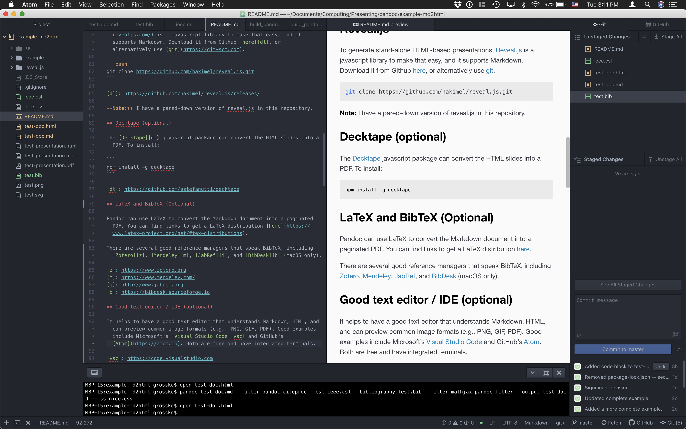
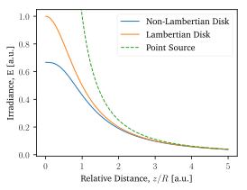

# Summary

Describes the necessary software packages and shell commands used to convert a [Markdown][1] document into a *stand-alone* HTML file or a stand-alone presentations.

It is straightforward to use MathJax to render TeX math in HTML. However, in general, an internet connection (or a stand-alone installation of MathJax) is required for this to work. This presents a method to avoid this dependence. In short, the generated HTML file can be shared with anyone using a modern web browser.

You can learn more about [Markdown here][2] and obtain a useful [cheat-sheet here][3].

[1]: https://en.wikipedia.org/wiki/Markdown
[2]: https://www.markdownguide.org
[3]: https://guides.github.com/pdfs/markdown-cheatsheet-online.pdf

I won't try to motivate why one might prefer writing in Markdown as opposed to Word, but if you are interested, see the following references:

[1](http://plain-text.co), [2](http://u.arizona.edu/~selisker/post/workflow/), [3](https://blog.kdheepak.com/writing-papers-with-markdown.html), [4](https://raphaelkabo.com/blog/posts/markdown-to-word/)

# Software dependencies

**Note**: The following assumes some familiarity with working at command line. This has been tested on a MacOS system and should be straightforward to implement in a UNIX / Linux environment. It is also possible in Windows, but the author has no direct experience with that.

## Pandoc

Read about [pandoc](https://pandoc.org).

Get an installer [here](https://github.com/jgm/pandoc/releases).

## MathJax javascript library

To install, you will need [Node.js and NPM](https://nodejs.org/en/).

Install a local copy of the [MathJax](https://www.mathjax.org) library.

```bash
npm install -g mathjax-node
npm install -g mathjax-node-cli
npm install -g mathjax-pandoc-filter
```

Note that the `-g` flag ensures the installation is done globally. If you don't have permissions for that, you can omit it. The important part is ensuring that the codes installed above are in the PATH and available at the command line.

Minimal test script to see if embedding math into html via pandoc is working:

```bash
echo '$$a_i$$' | pandoc --filter mathjax-pandoc-filter -s -t html5 -o temp.html
```

This should produce `temp.html` which, when opened in a modern web browser, should show the letter *a* with a subscript *i*.

More details about the [Github ref](https://github.com/lierdakil/mathjax-pandoc-filter)

## Reveal.js

To generate stand-alone HTML-based presentations, [Reveal.js](https://revealjs.com/) is a javascript library to make that easy, and it supports Markdown. Download it from Github [here][dl], or alternatively use [git](https://git-scm.com).

```bash
git clone https://github.com/hakimel/reveal.js.git
```

[dl]: https://github.com/hakimel/reveal.js/releases/

**Note:** I have a pared-down version of reveal.js in this repository.

## Decktape (optional)

The [Decktape][dt] javascript package can convert the HTML slides into a PDF. To install:

```
npm install -g decktape
```

[dt]: https://github.com/astefanutti/decktape

## LaTeX and BibTeX (Optional)

Pandoc can use LaTeX to convert the Markdown document into a paginated PDF. You can find links to get a LaTeX distribution [here](https://www.latex-project.org/get/#tex-distributions).

There are several good reference managers that speak BibTeX, including [Zotero][z], [Mendeley][m], [JabRef][j], and [BibDesk][b] (macOS only).

[z]: https://www.zotero.org
[m]: https://www.mendeley.com/
[j]: http://www.jabref.org
[b]: https://bibdesk.sourceforge.io

## Good text editor / IDE (optional)

It helps to have a good text editor that understands Markdown, HTML, and can preview common image formats (e.g., PNG, GIF, PDF). Good examples include Microsoft's [Visual Studio Code][vsc] and GitHub's [Atom](https://atom.io). Both are free and have integrated terminals.



[vsc]: https://code.visualstudio.com

# Minimal working examples

## HTML document

Save the following markdown example as `test-doc.md`

```markdown
---
title: Minimal working document
author: Anonymous
---

# Heading

Lorem ipsum dolor sit amet, mazim paulo assentior ius no, case cotidieque repudiandae ex sed. Munere nullam ei eum, fierent deleniti usu ut. Pro putant persius facilisi ea, nam ad aperiri consectetuer. At quem iusto mucius pro, eos in tantas adipisci. Eos mazim praesent eu, sea cu wisi insolens democritum. Veritus sapientem conclusionemque eam ne, ea ius dolores probatus recteque, ad nam amet enim nonumes [@MartinJA-2017].

Now some python code:

		```python
		# Imports
		import numpy as np
		import matplotlib.pyplot as plt

		# Define function
		def my_func(x):
			return x**2
		x = np.random.randn(100)
		y = f(x)

		# Visualize
		plt.figure()
		plt.plot(x,y,'.')
		plt.show()
		```

## Sub-Heading

Some text with inline math: $E = m c^2$, followed by a display equation.

$$f(x) = \int_{-\infty}^x e^{t} dt$$

## Now some images

{width=75%}

{width=75%}

# References

```

Now compile it to a stand-alone HTML file using the nice.css file to style the HTML. Note that the bibliography file `test.bib` is supplied, as is the citation format style `ieee.csl`.

```bash
pandoc test-doc.md --filter pandoc-citeproc --csl ieee.csl --bibliography test.bib --filter mathjax-pandoc-filter --output test-doc.html --to html5 --from markdown --standalone --self-containe
d --css nice.css
```

The images and style file are embedded in the HTML file, and should render nicely in a modern web browser.

## HTML presentation

Save the following markdown example as `test-presentation.md`. Note I have added a theme `nice_reveal` in `reveal.js/css/theme/`.

```markdown
---
title: Minimal working presentation
author: Anonymous
theme: nice_reveal
---

# Slide One

Some text.

---

# Slide 2

Some text with inline math: $E = m c^2$, followed by a display equation.

$$f(x) = \int_{-\infty}^x e^{t} dt$$

---

# Slide 3

Now some images:


```

Now compile it with pandoc:

```bash
pandoc test-presentation.md --filter mathjax-pandoc-filter --output test-presentation.html --to html5 --from markdown --standalone --self-contained -t revealjs -V revealjs-url=./reveal.js/
```

And if you have decktape installed, you can convert it to a PDF via:

```
decktape reveal --size 1024x768 --pause 50 test-presentation.html test-presentation.pdf
```

## More complete examples

See [here](./example/) for more thorough examples. I've also included the shell scripts I use to automate converting MD to HTML. Note that they'll need to be modified to work on your system.

# TODO
- [x] Add example .bib file and how to do a citation
- [ ] Add header / footer to slides

# Additional References

[pandoc issue](https://github.com/jgm/pandoc/issues/3153)

[pandoc tex2svg](https://github.com/jgm/pandoc-tex2svg)
