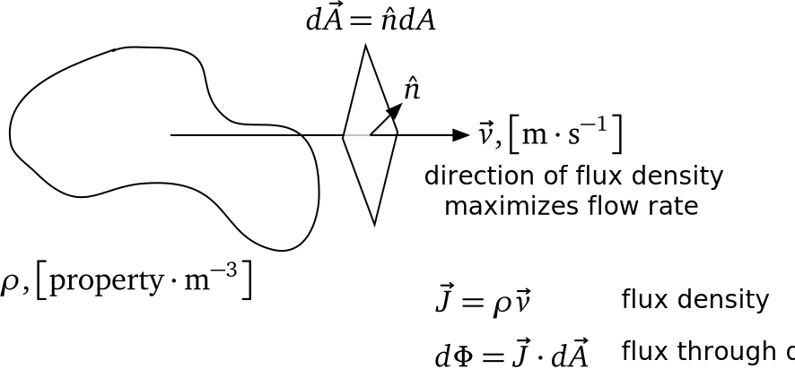

# Radiometry Defined

> the quantitative measurement of the energy content of optical radiation fields

- This includes how radiation is transmitted through the optical measurement system to the detector
- Traditionally, radiometry has focused on measurement of _incoherent_ radiation fields

---

# Coherence

- A monochromatic plane wave field $E(\vec{r},t) = E_0 \mathrm{e}^{(\vec{k} \cdot \vec{r} - \omega t)}$ is _coherent_
  - The phase $\phi = \vec{k} \cdot \vec{r} - \omega t$ is fixed for all time and space
- A traditional laser is highly coherent
  - The autocorrelation $\langle E(x,t) E(x+\xi,t+\tau)\rangle$ is appreciable for "large" spatial coherence length $\xi$ and temporal coherence time $\tau$

---

# Thermal sources are incoherent

- Thermal radiation sources (sun, incandescent bulbs, blackbody, etc.) produce _incoherent_ radiation
  - Myriad independent oscillators stochastically producing photons
  - Phase difference between any two plane waves is a random variable
  - Autocorrelation is essentially zero for any $\xi$ and $\tau$

---

# Assumptions

1. Radiation sources are incoherent
2. Radiation propagates via geometric optics
3. Energy of radiation fields is conserved when propagating through transparent media (vacuum)

We will relax #3 when we consider radiation propagation in participating media

---

# Angle and Solid Angle

{width=90%}

- Linear angle subtended by 2D object $l$ at point $v$ is $\theta = s/r$
- Solid angle subtended by 3D object $S$ at point $v$ is $\Omega = A/R^2$

---

# (Projected) Solid Angle

Take care to account for the projected area of the source onto the sphere

{width=70%}

::: notes

Solid angle of infinitesimal area $dA$ tilted with respect to the line-of-sight direction $\hat{\Omega}$

:::

---

# Example

What is the solid angle subtended by a right circular cone of half-angle $\alpha$?

{width=90%}

---

# Nomenclature

| symbol                             | term           | units                                    | notes               |
| ---------------------------------- | -------------- | ---------------------------------------- | ------------------- |
| $Q$                                | radiant energy | $\left[\mathrm{J}\right]$                |                     |
| $\Phi = \frac{dQ}{dt}$             | radiant flux   | $\left[\mathrm{W}\right]$                |                     |
| $M = \frac{d\Phi}{dA}$             | exitance       | $\left[\mathrm{W/m^2}\right]$            | leaving surface     |
| $E = \frac{d\Phi}{dA}$             | irradiance     | $\left[\mathrm{W/m^2}\right]$            | arriving at surface |
| $I = \frac{d\Phi}{d\Omega}$        | intensity      | $\left[\mathrm{W/sr}\right]$             |                     |
| $L = \frac{d^2\Phi}{dA_p d\Omega}$ | radiance       | $\left[\mathrm{W/(m^2 \cdot sr)}\right]$ | $dA_p d\Omega = \mathrm{abs}(d\vec{A} \cdot d\vec{\Omega})$ |

---

# Flux Density

- Useful concept in many transport phenomena
- Flow rate of a property density (mass, heat, charge, etc.) per unit area
- $\vec{J} = \rho \vec{v}$, $[\text{(property units)}\mathrm{\cdot m^{-2} \cdot s^{-1}}]$
- $\vec{J}(\vec{r})$ quantifies magnitude and direction of *maximal* flow rate at $\vec{r}$

{width=60%}

---

# Flux Density and Flux

- Flux is the total (property) flow across a specified area per unit time
  - Flux density: $d\Phi = \vec{J}\cdot d\vec{A}$
  - Flux: $\Phi = \int_A \vec{J}\cdot d\vec{A}$

- Radiant flux for plane wave (here $\vec{S} = \vec{J}$)
  - $E(z,t) = E_0 \mathrm{e}^{(k z - \omega t)} \hat{e}_z$
  - $\langle u \rangle = \frac{1}{2} \epsilon |E_0|^2$
  - $\vec{S} = \vec{E} \times \vec{H} = \frac{1}{2}\sqrt{\frac{\epsilon}{\mu}} |E_0|^2 \hat{e}_z$, $\left[ \mathrm{W/m^2}\right]$
  - Factor out $\epsilon$ yields
    $\vec{S} = \left(\frac{1}{2} \epsilon |E_0|^2\right) \frac{1}{\sqrt{\epsilon \mu}} \hat{e}_z = u \vec{v}$ where $\vec{v} = \frac{c_0}{n} \hat{e}_z$

---

# Radiance

- Non-negative scalar distribution function describing the radiation field
- Strictly, radiance ($L$) is defined in terms of its integral properties
{width=40%}
- Radiance is the function who's integral over area and solid angle and time gives the total radiant energy
  $$Q(\vec{r}) = \int_{t_1}^{t_2} \int_{A} \int_{\Omega} L(\vec{r},\hat{\Omega},t) d\hat{\Omega}\cdot d\vec{A} dt$$

---

# Radiance (2)

Radiance of a field can be defined as the radiant energy $Q(A,\hat{\Omega},\Delta t)$, as measured by an ideal detector of area $A$ collimated so that it only receives radiation within a solid angle $\Omega$, normalized by these extrinsic factors

$$L = \lim_{A,\Omega,t \rightarrow 0} \frac{Q(A,\Omega,t)}{A \cos \Theta \, \Omega \, \Delta t}$$

Why radiance?

- Characterizes the (scalar) radiation field, independent of source size, detector size, viewing distance and orientation, integration time
- It is an invariant quantity in a *non-participating* medium

---

# Radiance (3)

Differential flux - radiance relationship for *source* ($s$) and *detector* ($d$)

{width=90%}

- Here, radiance is a property of the source and line-of-sight direction
- Technically, radiance is a property of the EM field

---

# Radiance (4)

Total flux - radiance relationship for *source* (s) and *detector* (d)

{width=90%}

- Later, we'll learn how to relate source radiance to its material properties ($\tilde{N}(\nu)$, $T$) and its radiation environment (sun, sky, etc.)

---

# Irradiance / Exitance

:::::: {.columns}

::: {.column width="30%"}
- Radiant power per unit area
- Units: $\left[\mathrm{W/m^2}\right]$
- Irradiance $(E)$: *arriving*
- Exitance $(M)$: *leaving*
:::

::: {.column width="70%"}
{width=90%}
:::

::::::

---

# "Cos to the fourth"

*Problem*: consider a small, uniform Lambertian source $A_s$ and a detector $A_d$ separated by $r$ where $r^2 \gg A_s, A_d$. What is the radiant flux at the detector in each case?:

{width=95%}

---

# Intensity

- **Caution:** *Intensity* is an abused term – when you encounter it in the literature, be sure you know what the units are!
- Radiant power per unit solid angle; units: $\left[\mathrm{W/sr}\right]$
  $$I = \frac{d\Phi}{d\Omega} = \int_{A_s} L(A_s,\hat{\Omega}) \cos \Theta_s \, dA_s$$
- Note that $\hat{\Omega}$ is *constant* in the integral
- Intensity of common source from two distinct vantage points can differ
- Useful for point sources and *distant* extended objects subtending a *small* solid angle at the detector

---

# Intensity and Irradiance

- Consider the irradiance (*at a point*) of a *point source*
  - There is only *one* direction $\hat{\Omega}$ since we're connecting a source *point* with a detector *point*
  - $d^2\Phi = L(A_s, \hat{\Omega}) \cos \Theta_s dA_s \cos \Theta_d dA_d r_{\hat{\Omega}}^{-2}$
  - $d\Phi = \left( \int_{A_s} L(A_s, \hat{\Omega}) \cos \Theta_s dA_s \right) \cos \Theta_d dA_d r_{\hat{\Omega}}^{-2} = I(\hat{\Omega}) \cos \Theta_d dA_d r_{\hat{\Omega}}^{-2}$
  - Thus, $E = \frac{d\Phi}{dA_d} = I(\hat{\Omega}) \cos \Theta_d / r^{2}_{\hat{\Omega}}$
- What about irradiance from a resolvable, *extended* source?
  - An intensity can be computed for any source, but it is not useful here
  - Now we're connecting *multiple source points* with a detector point, *i.e.* must account for $\hat{\Omega} = \hat{\Omega}(A_s, A_d)$ and $r_{\hat{\Omega}} = r_{\hat{\Omega}}(A_s, A_d)$ when summing over all elemental source contributions to the detector point.

---

# Spectral quantities

- The electromagnetic field can contain different amounts of energy at different wavelengths / frequencies
- Our previous radiometric terms implicitly *integrated* over all frequencies
- Now have spectral dependence to our distribution functions, *e.g.*
  - $L_\nu = \frac{\Phi(\Delta \Omega, \Delta A, \Delta \nu)}{\Delta \Omega \Delta A \cos \Theta \Delta \nu}, \,\, L_\lambda = \frac{\Phi(\Delta \Omega, \Delta A, \Delta \lambda)}{\Delta \Omega \Delta A \cos \Theta \Delta \lambda}$
- The spectral distributions are not equivalent functions!
  - $L_\nu d\nu = L_\lambda d\lambda$ and $L = \int_{\Delta \nu} L_\nu d\nu = \int_{\Delta \lambda} L_\lambda d\lambda$
  - $L_\nu \neq L_\lambda$
  - Must account for the differential relationship between $\nu$ and $\lambda$: $\lambda \nu = c \implies d\nu = -c \lambda^2 d\lambda$

---

# Spectral quantities (2)

- SI units
  - $L_\nu \,\, \mathrm{\left[ W / (m^2 \cdot sr \cdot Hz) \right]}$
  - $L_\lambda \,\, \mathrm{\left[ W / (m^2 \cdot sr \cdot m) \right]} \left( = \mathrm{\left[ W / (m^3 \cdot sr) \right]} \text{ NO!}\right)$
- Wavenumber: $\tilde{\nu} = \frac{1}{\lambda} \mathrm{\left[cm^{-1}\right]}$
  - $L_{\tilde{\nu}} \,\, \mathrm{\left[W / (cm^2 \cdot sr \cdot cm^{-1})\right]} \left( = \mathrm{\left[ W / (cm \cdot sr) \right]} \text{ NO!}\right)$
- Flick: $L_\lambda \,\, \mathrm{\left[W / (cm^2 \cdot sr \cdot {\mu}m)\right]}$
