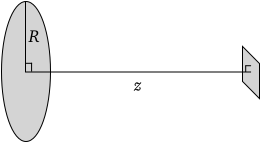
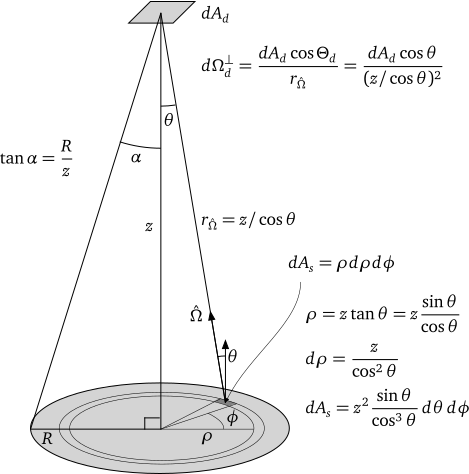
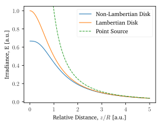

# Set up python environment

```python
# Import packages
import numpy as np
import scipy as sp
from sympy import *
import matplotlib as mpl
import matplotlib.pyplot as plt

# Set plotting defaults
mpl.rcParams['text.usetex'] = True
mpl.rcParams['font.family'] = 'charter'
mpl.rcParams['font.serif'] = 'charter'
mpl.rcParams['text.latex.preamble'] = r'\usepackage{XCharter}'
mpl.rcParams["figure.figsize"] = [4,3]
mpl.rcParams['lines.linewidth'] = 1.0
mpl.rcParams['savefig.transparent'] = True
mpl.rcParams['savefig.bbox'] = 'tight'
mpl.use('macosx'); plt.ion() # interactive plotting
```

# Problem 2.2

A disk of radius $R$ is a non-Lambertian emitter of radiance $L = L_0 \cos \theta$ where $\theta$ is the angle between the surface normal and the direction of observation.

1. Calculate the radiant exitance of the source.
2. Calculate the intensity of the source.
3. Calculate the irradiance on a screen at a distance $z$.



## Solution, Part 1

> Calculate the radiant exitance of the source

To compute the radiant exitance, we place the origin of our coordinate system on the disc with the $z$-axis normal to the surface. Then we integrate the radiance from an infinitesimal patch over the hemisphere above it.

$$M = \int_{2\pi\,\mathrm{sr}} L(\hat{\Omega}) \cos \Theta_s d\Omega$$

$$M = \int_{\phi=0}^{2\pi} \int_{\theta=0}^{\pi/2} \left( L_0 \cos \theta \right) \cos \theta \sin \theta \, d\theta \, d\phi$$

$$M = 2\pi L_0 \int_{\theta=0}^{\pi/2} \cos^2 \theta \sin \theta \, d\theta = \frac{2}{3} \pi L_0$$

Thus, $M=\frac{2}{3} \pi L_0$. Note that this is less than the Lambertian result of $M_{Lam}=\pi L_0$. A Lambertian source of radiance $L_0$ puts out the same radiance in every direction, so will always be larger than a non-Lambertian source with *peak* radiance $L_0$.

## Solution, Part 2

> Calculate the intensity of the source

Intensity is the integral of radiance over the source area for a specific direction $\hat{\Omega}$. In this problem, the source has azimuthal symmetry, so our direction will be specified by the angle $\Theta_s = \theta$ relative to the $z$-axis. Thus,

$$I = \int_{A_s} L(A_s,\hat{\Omega}) \cos \Theta_s dA_s = \int_{A_s} L_0 \cos^2 \theta dA_s = \pi R^2 L_0 \cos^2 \theta$$

## Solution, Part 3

> Calculate the irradiance on a screen at a distance $z$

Recall the geometry from the Lambertian disk problem we developed in class:

{ width=90% }

We can develop our expression for the differential flux, integrate over the source area and normalize out the detector area, arriving at the irradiance.

$$d^2\Phi = L(A_s,\hat{\Omega}) \cos \Theta_s \, dA_s \, d\Omega_d^\perp$$

$$d^2\Phi = \left(L_0 \cos \theta\right) \cos \theta \left( z^2 \frac{\sin \theta}{\cos^3 \theta} \,d\theta \,d\phi \right) \left( \frac{dA_d \cos^3 \theta}{z^2}\right) \, dA_d$$

$$d^2 \Phi = L_0 \cos^2\theta \sin\theta \, d\theta \, d\phi \, dA_d$$

$$E = \int_{A_s} d^2\Phi = 2\pi L_0 \int_{\theta=0}^\alpha \cos^2\theta \sin\theta \, d\theta$$

Now let's use a computer algebra system to perform the integral over $\theta$, noting that $\alpha = \tan^{-1}(R/z)$.

```python
alpha, theta, R, z = symbols('\\alpha, \\theta, R, z')
ans = integrate(cos(theta)**2 * sin(theta), (theta,0,alpha))
ans = ans.subs(alpha, atan(R/z))
print_latex(ans)
```

$\text{ans} = \frac{1}{3} - \frac{1}{3 \left(\frac{R^{2}}{z^{2}} + 1\right)^{\frac{3}{2}}}$

Thus, we arrive at $E = \frac{2}{3} \pi L_0 \left(1 - \left(1+(R/z)^2\right)^{-3/2} \right)$.

As $z \rightarrow 0$ and/or $R \rightarrow \infty$ so that the disk fills the entire viewing hemisphere of the detector, note that $E \rightarrow \frac{2}{3} \pi L_0 = M$, as it should. We should also explore the limit in which $z \gg R$. In this case, $\left(1+(R/z)^2\right)^{-3/2} = \left(1+x\right)^{-3/2}$ where $0<x\ll 1$.

```python
x = symbols('x')
ans = series((1+x)**(-3/2), x, 0, 2)
print_latex(ans)
```

$\text{ans} = 1 - \frac{3}{2} x + \mathcal{O}(x^2)$

Thus, for $z \gg R$, $E \rightarrow \frac{\pi R^2 L_0}{z^2} = \frac{I(\theta = 0)}{z^2}$. We've recovered the expected $1/z^2$ irradiance fall-off with distance from a point source.

Let's visualize the difference in $z$-dependence of irradiance for this disk with that of a Lambertian disk of $L=L_0$.  Recall for that, our answer was $E_{Lam} = \pi L_0 \left( \frac{R^2}{R^2 + z^2}\right) = \pi L_0 \left(1 + (z/R)^2\right)^{-1}$. We'll also compare these to the irradiance of a point source, $E = I/z^2$.

The python code:

```python
# irradiance functions
def E(z, R=1.0, L=1.0/np.pi):
    """Compute irradiance from non-Lambertian disk"""
    return 2/3 * np.pi * L * (1 - (1 + (R/z)**2)**(-3/2))

def E_lam(z, R=1.0, L=1.0/np.pi):
    """Compute irradiance from Lambertian disk"""
    return np.pi * L * (1+(z/R)**2)**(-1)

def E_ps(z, R=1.0, L=1.0/np.pi):
    """Compute irradiance from point source"""
    return np.pi * R**2 * L / z**2

z = np.linspace(1e-4,5,100) # z/R relative distance

# print error values
err_disk = 100 * np.abs(E(3)-E_lam(3))/E_lam(3)
err_ptsrc = 100 * np.abs(E(5)-E_ps(5))/E_ps(5)
print(f"Lamb. vs non-Lamb. rel error: {err_disk:0.1f}%")
print(f"Lamb. vs non-Lamb. rel error: {err_ptsrc:0.1f}%")

# generate figure
plt.figure()
plt.plot(z,E(z), label='Non-Lambertian Disk')
plt.plot(z,E_lam(z), label='Lambertian Disk')
y0, y1 = plt.ylim() # capture y-axis limits
plt.plot(z,E_ps(z), '--', label='Point Source')
plt.ylim(y0,y1) # avoid point source blowing up at origin
plt.legend(fancybox=True, framealpha=0.25)
plt.xlabel('Relative Distance, $z/R$ [a.u.]')
plt.ylabel('Irradiance, E [a.u.]')
plt.savefig('./figs/Ch02-P2-Part3.svg')
```

```
Lamb. vs non-Lamb. rel error: 2.5%
Lamb. vs non-Lamb. rel error: 4.8%
```

{ width=90% }

In this example, $L_0 = 1/\pi$ so that the Lambertian source exitance is $M=1$ and the non-Lambertian source is $M=2/3$. Note both fall off quickly with distance, and by $z = 3R$, the two results differ by about 2.5%. By $z = 5R$, the disks differ by less than 5% of the point-source result.
